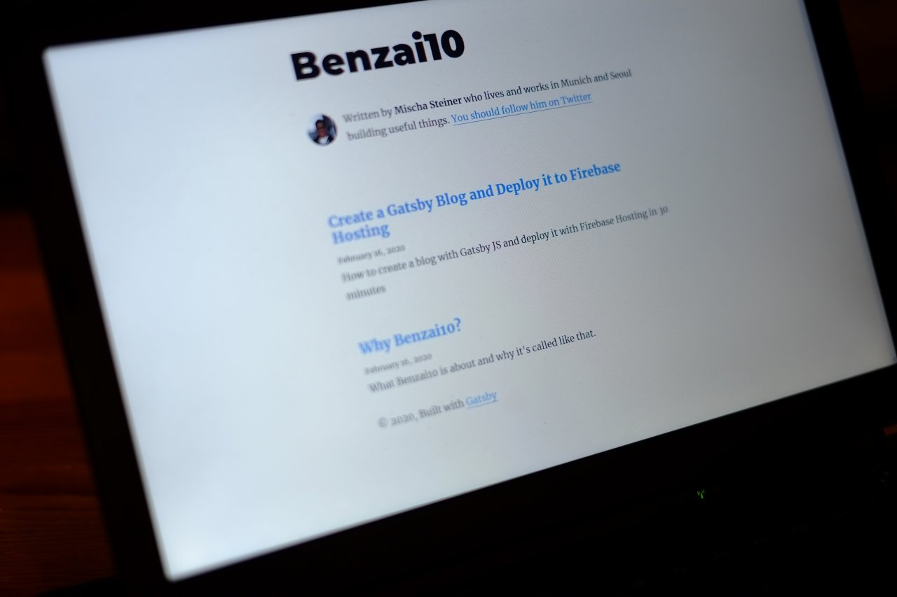

Objectives
---
1. Create a blog with Gatsby JS based on a starter template
2. Change or add some configurations
3. Add or edit some content
4. Deploy it to Firebase Hosting

Gatsby JS
---
Gatsby is a free and open source framework based on React that generates very fast websites. Read more [here](https://www.gatsbyjs.org/docs/).

I already have some experience in React (a Javascript library) development, so Gatsby seemed to be an interesting path to take. Even more so, because I use Emacs as my main editor and I was looking for easy ways to generate blog content from within Emacs. Using `org-mode` (an Emacs plugin) and [Hugo](https://gohugo.io/) was the initial idea, but I stumbled upon Gatsby and gave it a try first. I might later do a comparison between Gatsby and Hugo.

So far, I'm quite happy with Gatsby and how it can be deployed on Google Firebase. This article is about my first steps from generating the project until having it available under the current URL.

Writing Documentation and Blog Articles
---
I know how hard it is to write documentation and even how more it takes to write good documentation. Often, great (or at least decent) documentation is a criteria for me to choose a product. Some examples:

* Google Cloud Platform vs. AWS
* Elixir and Phoenix
* Emacs and its built-in documentation
* Lately, I started also to embrace the man pages available on Linux
* And, most recently, Gatsby made a good first impression as well

So that's why I don't aim to replicate well documented stuff but I rather try to document my user experience and add some comments or know-how that often get ignored in the original documentation. One objective of an article is to provide a loose step-by-step documentation for future reference. I'm experimenting and we will see how my articles evolve over time.

Gatsby Starter Blog
---
If you want to learn about Gatsby, I recommend to just go through the official [tutorial](https://www.gatsbyjs.org/tutorial/). You will get introduced to the concept of starters already in part 2 of the tutorial.

For this blog, I used the [gatsby-starter-blog](https://www.gatsbyjs.org/starters/gatsbyjs/gatsby-starter-blog/). If you look at the section "Features" you can see that a lot of useful stuff comes with it out of the box.

I got started with: `gatsby new bzt-website https://github.com/gatsbyjs/gatsby-starter-blog`

Run the website in your local development environment with `gatsby develop`.

First few changes:
* Change metadata and add the tracking ID for Google Analytics in the `gatsby-config.js` file
* Delete the example blog entries from the `content/blog/` folder

Add New Blog Entry
---
If you have deleted the existing blog entries and you don't know how to enter a new one, just check the gatsby-starter-blog [repo](https://github.com/gatsbyjs/gatsby-starter-blog) on Github for reference.

What you also need is a basic understanding of [Markdown](https://www.markdownguide.org/basic-syntax/) formatting and syntax.

> A blog entry gets its own folder in the parent folder `content`, the markdown-formatted content is in a file called `index.md` within this new folder. The name of the folder becomes the [slug](https://en.wikipedia.org/wiki/Clean_URL#Slug) of the article's URL.

Deploy? Make it so!
---
I already have several projects deployed and running on Google Cloud Platform services so I'll do the same for this blog for the time being.

Steps usually done for first deployment:
* Create a new project in the Firebase console
* Make sure you have the `firebase-tools` available on your machine
* Make sure you're logged in with the correct account (`firebase login`)
* Run `firebase init` and choose the newly created project for Firebase Hosting
* Run `gatsby build`
* Run `firebase deploy`

Configure Custom Domain
---
Firebase Hosting enables [custom domains](https://firebase.google.com/docs/hosting/custom-domain). I use Namecheap as my domain registrar. Make sure that you delete all existing CNAME, TXT or A records via the domain management on Namecheap, otherwise your custom domain URL and/or the secured connection via https will not work.

Et voila! That's how I got this blog online in less than 30 minutes (finishing this article took me longer though).

Backlog Stuff
---
This is random stuff which needs to be added to this article or is planned for a future article.

* Saving an .md file doesn't hotload during development
* Update the favicon
* Add a comment section
* Configure my laptop to support SSH authentication for multiple Github accounts

_last updated: February 16, 2020_
